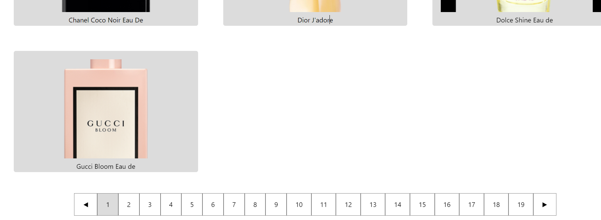

# pagination-react

Pagination in reactjs



# Design and Implementation

1. We have state for products array.
2. We have page state to show page
3. TotalPages state tell the tolal pages recieved from the backend.
4. useEffect fetches the data from the backend

`https://dummyjson.com/products?limit=10&skip=${page * 10 - 10}`

The url display 10 items and skips the page, for example page = 2 , then 1st 10 items will be skipped.

```
 {products.length > 0 && (
        <div className="pagination">
          <span
            disabled={page === 1}
            onClick={() => selectPageHandler(page - 1)}
          >
            ◀
          </span>
          {[...Array(totalPages)].map((_, i) => (
            <span
              className={page === i + 1 ? "pagination__selected" : ""}
              onClick={() => selectPageHandler(i + 1)}
              key={i}
            >
              {i + 1}
            </span>
          ))}
          <span
            disabled={page === totalPages}
            onClick={() => selectPageHandler(page + 1)}
          >
            ▶
          </span>
        </div>
      )}
```

This is the complete logic of pagination.

1. We have two buttons to go forward and backward.
2. The totalpages numbers are created from 1....totalpages.
